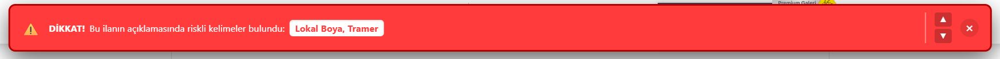

# Araç Kriter Kontrolü Chrome Eklentisi

Bu eklenti, Sahibinden.com web sitesindeki araç ilanlarını gezerken ilan açıklamalarında yer alabilecek **riskli kelimeleri (değişen, boya, tramer, ağır hasar vb.)** otomatik olarak tarar ve eğer bulursa ekranın üst kısmında belirgin bir uyarı kutusu gösterir.

Ayrıca bulunan yasaklı kelimeleri ilan metni içinde **sarı fosforlu ve kırmızı yazılı** şekilde vurgular, böylece uzun numaralar ve açıklamalar arasında kaybolmadan direkt olarak kelimeleri görebilirsiniz.

## Özellikler

- İlan açıklamalarını anlık (dinamik) olarak yüklenme bittikten sonra da takip eder.
- Bulunan riskli kelimeleri ekranın üst tarafına yaslanmış kırmızı bir kutuyla size bildirir.
- Uyarı kutusundaki **Aşağı (▼)** ve **Yukarı (▲)** butonları sayesinde vurgulu kelimelere ekranda otomatik olarak kaydırabilirsiniz (Scroll özelliği).
- Metin içerisindeki kelimeler dikkat çekici renklerle işaretlenir.

## Nasıl Kurulur? (Geliştirici Modu)

Bu eklenti şu an için Chrome Web Mağazası'nda yer almadığı için "Geliştirici Modu" ile elle yüklenmelidir.

1. Bilgisayarınızda Google Chrome tarayıcısını açın.
2. Adres çubuğuna şunu yazın ve Enter'a basın:
   \`chrome://extensions/\`
3. Açılan sayfanın **sağ üst köşesinde** yer alan **"Geliştirici modu"** (Developer mode) anahtarını açık (mavi) konuma getirin.
4. Sol üst köşede beliren **"Paketlenmemiş öğe yükle"** (Load unpacked) butonuna tıklayın.
5. Klasör seçme penceresi açıldığında, eklenti dosyalarının bulunduğu **\`sahibinden-extension\`** klasörünü seçin.
6. Eklenti listeye "Araç Kriter Kontrolü" ismiyle eklenecektir.

## Nasıl Kullanılır?

- Kurulum tamamlandıktan sonra herhangi bir Sahibinden ilan sayfasına girdiğinizde eklenti otomatik olarak çalışacaktır.
- Eğer ilan açıklamalarında yasaklı/kriter bir kelime bulunursa (örneğin "tramer", "şase işlemli"), ekranın üst kısmında kırmızı bir uyarı kutusu göreceksiniz.
- Uyarı kutusundaki sağ yön butonlarıyla (`▲` ve `▼`) kelimelerin bulunduğu satırlara anında atlayabilirsiniz.

## Dosya Yapısı

- `manifest.json`: Eklentinin adı, versiyonu ve hangi sayfalarda çalışacağını belirten ayar dosyasıdır.
- `content.js`: Sahibinden.com sayfası yüklendiğinde metinleri tarayıp HTML'e müdahale eden asıl JavaScript kodunu barındırır.
- `content.css`: Eklenen uyarı kutusunun tasarımsal detaylarını, butonları ve metin içi vurgulamaları (Sarı fosfor vb.) içerir.

## Özelleştirme (Kelime Ekleme/Çıkarma)

Eğer yeni bir yasaklı kelime eklemek veya silmek isterseniz `content.js` dosyasını not defteri ile açarak en üstteki **`keywords`** dizisine yeni kelimenizi ekleyebilirsiniz.
Değişiklik yaptıktan sonra `chrome://extensions/` sayfasından eklenti kartındaki **Yenile (🔄)** ikonuna tıklamanız değişikliklerin aktif olması için yeterlidir.
